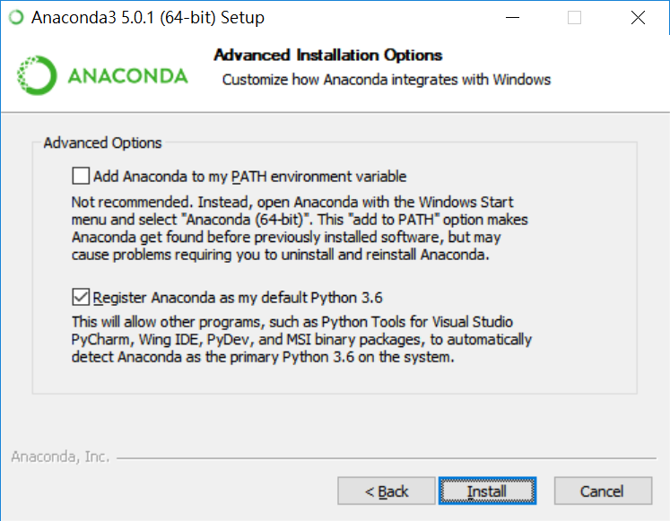

# Conda 簡介
開發 #python  專案時，最常遇見的問題就是不同專案可能會有不同的`Python`版本以及不同的`package`需要安裝，那麼在管理上就會是一個問題了。如果希望再電腦內快速佈署不同的方案或是版本套件等，那[Anaconda](https://www.anaconda.com/products/individual)的套件管理系統conda將會是值得使用的系統。

`conda`命令是管理在安裝不同`package`時的主要介面，使用`conda`時，可以針對不同**Python**版本及**Packages**，進行以下動作
- 建立環境(`create`)
- 輸出環境(`export`)
- 列出套件(`list`)
- 移除環境(`remove`)
- 更新環境(`update`)

## Anaconda 安裝方法
Anaconda 其實是一款私人企業所維護的套件管理程式，其中使用該套件管理程式最大的優勢在於，可以用該軟體提供的GUI進行環境管控，對於不熟悉*command line*的使用者來說，是快速上手的好幫手。

安裝方式很簡單，首先到[官方網站下載](https://www.anaconda.com/products/individual#Downloads)，選擇自己電腦符合的版本與作業系統，並且依照步驟進行安裝，其中過程當中會出現下列圖片

這邊建議直接勾選新增，可節省後續的設定。

### 確認 conda 的版本
再安裝完成conda後可以透過命令提示字元進行版本確認，指令碼如下：
```
conda -V
```
結果如下圖所示：


## 更新conda 
完成安裝後，最重要的就是先進行更新動作，確認conda 再最新版本
指令如下：
```
conda update conda
```
這時候conda 會列出所有需要更新的套件並詢問是否更新，這時候再文字列打入`y`即可。
## 用conda建立python環境
接下來，要利用conda 建立一個新的python的環境
首先先利用這個指令列出目前已經安裝的環境
```
conda env list
```
預設應該有一組`base`，並且前面打一個\*字號表示為預設。
此時，可利用`create`指令建立一個新的環境，並且指定他的python 版本

指令如下：
```
conda create --name [名稱] python=[版本]
```
此時我們可以再利用剛剛前面所提到的`env list` 這個指令，確認是否有成功創建這個新的環境。
若有成功產生，可利用下面指令進行環境切換
```
codna activate [名稱]
```
這時候，應該可以看到命令提示字元的路徑前面出現一個小括號\( \)，裡面即是命名的環境
### 安裝套件
安裝套件是python的一個重要功能，相關的套件都可以透過[import](python_import語句)指令進行呼叫，但是不同版本的套件或是python可能會有所衝突，這時候將環境分隔開來便可以有效的管理，不會因為某個程式的套件與某套件產生衝突，使得需要降低版本或是升級，而一旦執行這個命令又會導致其他已經完成或正在撰寫的python產生問題，因此利用**conda**進行管理是十分有幫助的。

指令如下：
```
conda install [套件名稱]
```
使用conda進行套件安裝有個好處，他會自動幫使用者把相依套件進行統一的打包下載。
### 列出套件
利用下列指令可以列出目前環境下的所有套件
```
conda list
```
大概會長的像這樣

Name | Version | Build | Channel
:------:|:--------:|:-----:|:---------:
numpy | 1.18.5 | pypi_0 |
pandas | 1.1.3 | py37ha925a31_0 |
opencv | 3.4.2 | py37h40b0b35_0 | 

將所有的套件與版本及內容詳列出來。
### 更新套件
更新所有套件
```
conda upgrade -y --all
```
更新指定套件
```
conda upgrade [套件名稱]
```

### 移除套件
```
conda remove [套件名稱]
```
這樣就可以移除所有套件了。
## 移除環境
如果最後要移除環境及所有安裝在此環境下的套件，可使用下列指令
```
conda env remove --name [環境名稱]
```
如此一來，就可以整個環境了
## 匯入與匯出環境
最後要介紹的是將整個已經使用完成的環境給輸出成[副檔名](副檔名)為yaml的檔案
```
conda env export --name [環境名稱] --file [路徑\檔名.yaml]
```
變會在指定的路徑輸出一個yaml檔案，以供未來的其他機台匯入使用
```yaml
name: cv
channels:
  - defaults
dependencies:
  - blas=1.0=mkl
  - ca-certificates=2020.10.14=0
  - certifi=2020.6.20=pyhd3eb1b0_3
  - hdf5=1.8.20=hac2f561_1
  - icc_rt=2019.0.0=h0cc432a_1
  - intel-openmp=2020.2=254
  - jpeg=9b=hb83a4c4_2
  - libopencv=3.4.2=h20b85fd_0
  - libpng=1.6.37=h2a8f88b_0
  - 以下省略....
prefix: C:\Users\user\anaconda3\envs\cv
```

而往後如果要將這個環境套用到新的主機或是設備中，則可以配合前面題過得`create`指令進行
詳細如下：
```
conda env create --file [路徑\名稱.yaml] --name [環境名稱]
```

如此一來就不怕已經完成的程式碼到其他機台的環境無法使用了
可以直接再其他有安裝conda的機台中直接完全移植目前的使用環境


#python #conda #環境建立 #程式設計 